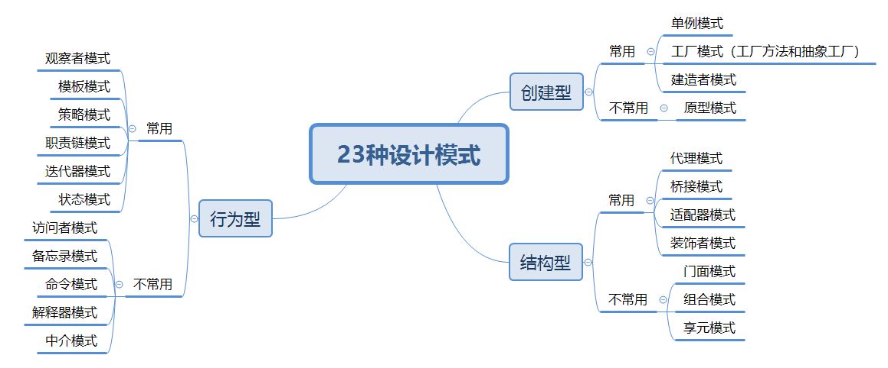

# design-pattern
## 设计模式

### 1、大纲

### 2、设计模式思维导图

### 3、设计原则

SOLID 原则，实际上，SOLID 原则并非单纯的 1 个原则，而是由 5 个设计原则组成的，它们分别是：单一职责原则、开闭原则、里式替换原则、接口隔离原则和依赖反转原则，依次对应 SOLID 中的 S、O、L、I、D 这 5 个英文字母

- 单一职责原则(SRP)：Single Responsibility Principle，缩写为 SRP。这个原则的英文描述是这样的：A class or module should have a single responsibility。如果我们把它翻译成中文，那就是：一个类或者模块只负责完成一个职责（或者功能）。不要设计大而全的类，要设计粒度小、功能单一的类。单一职责原则是为了实现代码高内聚、低耦合，提高代码的复用性、可读性、可维护性。

